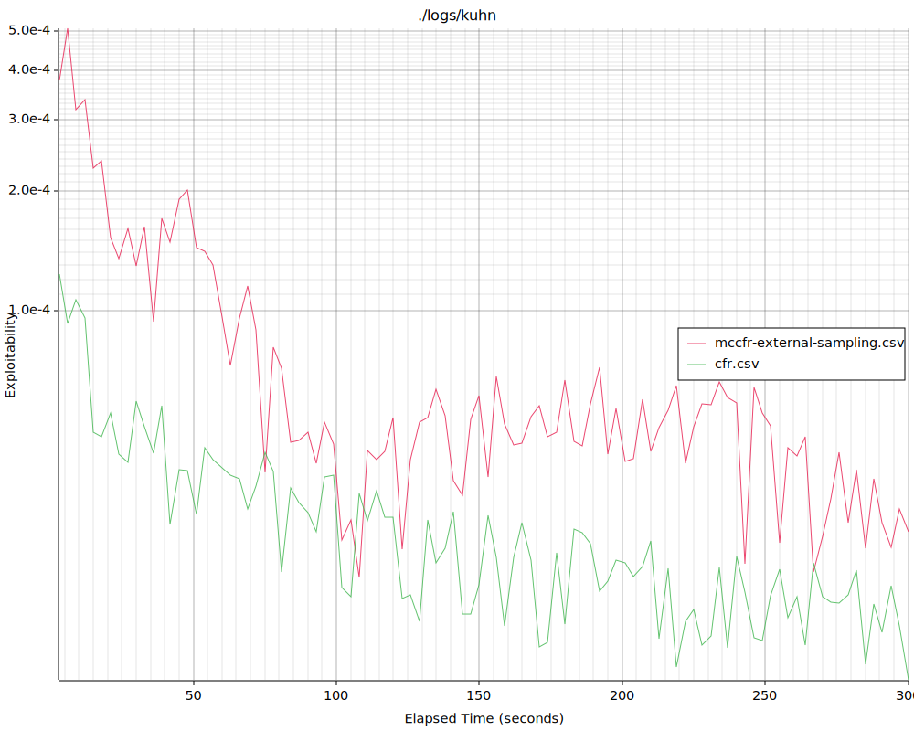
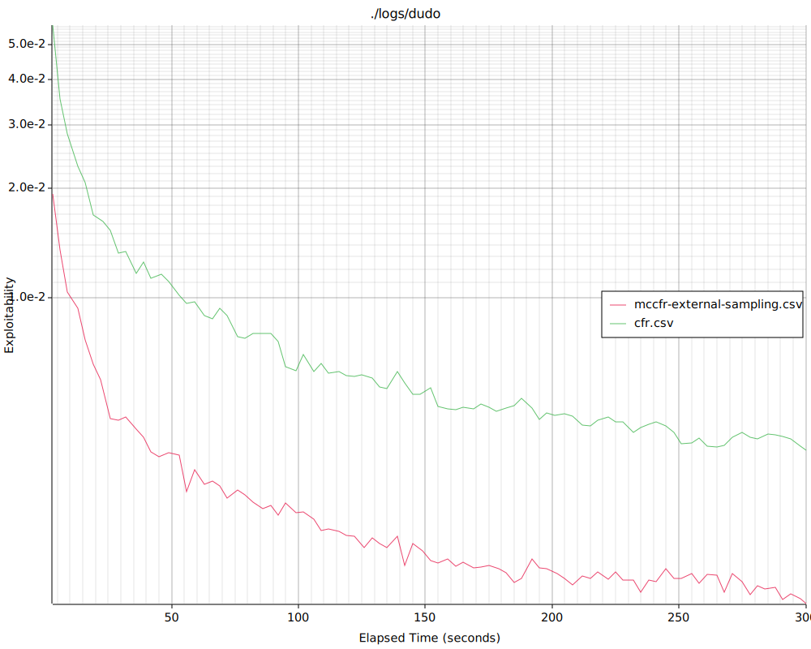

# A Counterfactual Regret Minimization (CFR) playground written in Rust

## Reference: An Introduction to Counterfactual Regret Minimization
http://modelai.gettysburg.edu/2013/cfr/cfr.pdf

# Results
```
./run_all.sh 5m
```
## Kuhn Poker

## Dudo Poker

## Leduc Poker

