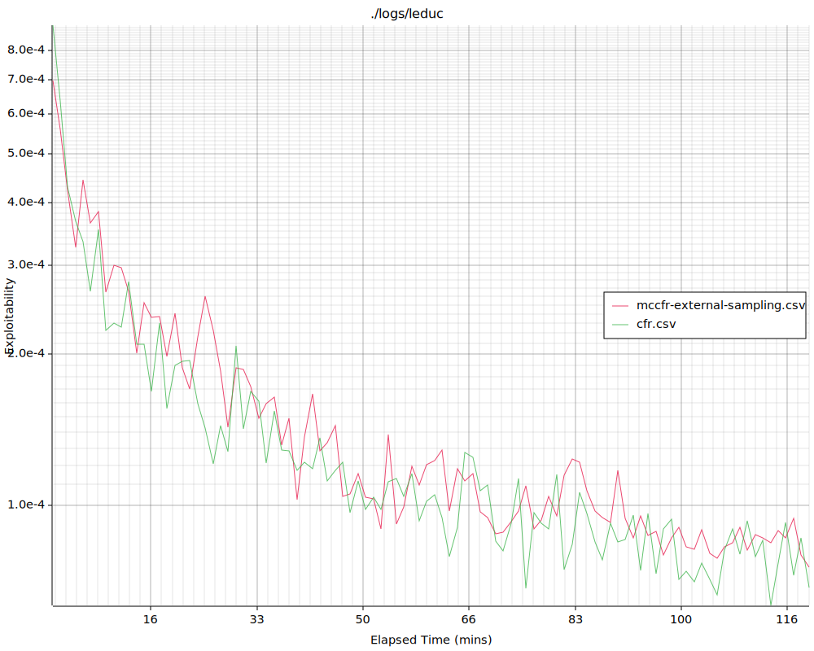

# An Introduction to Counterfactual Regret Minimization
http://modelai.gettysburg.edu/2013/cfr/cfr.pdf

## Rock Paper Scissors
```
$ cargo run --release -p rps
...
[2022-11-15T14:07:27Z INFO  rps] Player: Regret[683, -342, -29, ]
    Strategy[683, 0, 0, ]
    Avg-Strategy[0.33529, 0.33250, 0.33221, ]
```

## Colonel Blotto
```
$ cargo run --release -p blotto
...
[2022-11-15T14:06:20Z INFO  blotto] Avg-Strategy [
      Strategy    Probability
      (5,0,0,)    0.00000
      (4,1,0,)    0.00000
      (3,2,0,)    0.11356
      (2,3,0,)    0.10573
      (1,4,0,)    0.00000
      (0,5,0,)    0.00000
      (4,0,1,)    0.00000
      (3,1,1,)    0.10943
      (2,2,1,)    0.00000
      (1,3,1,)    0.11118
      (0,4,1,)    0.00000
      (3,0,2,)    0.11865
      (2,1,2,)    0.00000
      (1,2,2,)    0.00000
      (0,3,2,)    0.10141
      (2,0,3,)    0.11519
      (1,1,3,)    0.10873
      (0,2,3,)    0.11611
      (1,0,4,)    0.00000
      (0,1,4,)    0.00000
      (0,0,5,)    0.00000
    ]
```

## Kuhn Poker
```
$ cargo run --release -p kuhn
    Finished release [optimized + debuginfo] target(s) in 0.01s
     Running `/home/niwasaki/work/cfr-rs/target/release/kuhn`
[2022-11-16T19:32:05Z INFO  kuhn] Training has finished
[2022-11-16T19:32:05Z INFO  kuhn] Average game value: -0.05569656776233496
[2022-11-16T19:32:05Z INFO  kuhn] Nodes [
[2022-11-16T19:32:05Z INFO  kuhn]     Node(0 Jack , [None       ,None       ]): Pass: 0.8865, Bet: 0.1135
[2022-11-16T19:32:05Z INFO  kuhn]     Node(0 Queen, [None       ,None       ]): Pass: 1.0000, Bet: 0.0000
[2022-11-16T19:32:05Z INFO  kuhn]     Node(0 King , [None       ,None       ]): Pass: 0.6571, Bet: 0.3429
[2022-11-16T19:32:05Z INFO  kuhn]     Node(1 Jack , [Some(Pass) ,None       ]): Pass: 0.6663, Bet: 0.3337
[2022-11-16T19:32:05Z INFO  kuhn]     Node(1 Queen, [Some(Pass) ,None       ]): Pass: 1.0000, Bet: 0.0000
[2022-11-16T19:32:05Z INFO  kuhn]     Node(1 King , [Some(Pass) ,None       ]): Pass: 0.0000, Bet: 1.0000
[2022-11-16T19:32:05Z INFO  kuhn]     Node(0 Jack , [Some(Pass) ,Some(Bet)  ]): Pass: 1.0000, Bet: 0.0000
[2022-11-16T19:32:05Z INFO  kuhn]     Node(0 Queen, [Some(Pass) ,Some(Bet)  ]): Pass: 0.5528, Bet: 0.4472
[2022-11-16T19:32:05Z INFO  kuhn]     Node(0 King , [Some(Pass) ,Some(Bet)  ]): Pass: 0.0000, Bet: 1.0000
[2022-11-16T19:32:05Z INFO  kuhn]     Node(1 Jack , [Some(Bet)  ,None       ]): Pass: 1.0000, Bet: 0.0000
[2022-11-16T19:32:05Z INFO  kuhn]     Node(1 Queen, [Some(Bet)  ,None       ]): Pass: 0.6668, Bet: 0.3332
[2022-11-16T19:32:05Z INFO  kuhn]     Node(1 King , [Some(Bet)  ,None       ]): Pass: 0.0000, Bet: 1.0000
[2022-11-16T19:32:05Z INFO  kuhn] ]
```

## 1-Die-Versus-1-Die Dudo
100000 iterations seem not enough to get a nice result. [See full result](./dudo/result_100000.txt)
```
$ cargo run -p dudo --release
package:   /home/niwasaki/work/cfr-rs/dudo/Cargo.toml
workspace: /home/niwasaki/work/cfr-rs/Cargo.toml
    Finished release [optimized + debuginfo] target(s) in 0.01s
     Running `target/release/dudo`
[2022-11-21T10:06:30Z INFO  dudo] epoch 10000: Average game value: -0.02716729415692538
[2022-11-21T10:06:40Z INFO  dudo] epoch 20000: Average game value: -0.030589054048634386
[2022-11-21T10:06:52Z INFO  dudo] epoch 30000: Average game value: -0.02833424390423212
[2022-11-21T10:07:02Z INFO  dudo] epoch 40000: Average game value: -0.025872797425665898
[2022-11-21T10:07:14Z INFO  dudo] epoch 50000: Average game value: -0.023232372899696895
[2022-11-21T10:07:26Z INFO  dudo] epoch 60000: Average game value: -0.022904289030294452
[2022-11-21T10:07:36Z INFO  dudo] epoch 70000: Average game value: -0.02376921718530667
[2022-11-21T10:07:47Z INFO  dudo] epoch 80000: Average game value: -0.02093596898523663
[2022-11-21T10:07:57Z INFO  dudo] epoch 90000: Average game value: -0.020482309527228924
[2022-11-21T10:08:07Z INFO  dudo] Training has finished
[2022-11-21T10:08:07Z INFO  dudo] Nodes [
[2022-11-21T10:08:07Z INFO  dudo]     Player0[0, 0, 0, 0, 0, 1]  [][1x1: 0.000, 2x1: 0.000, 1x2: 0.134, 2x2: 0.000, 1x3: 0.097, 2x3: 0.000, 1x4: 0.051, 2x4: 0.000, 1x5: 0.000, 2x5: 0.000, 1x6: 0.717, 2x6: 0.000, ]
[2022-11-21T10:08:07Z INFO  dudo]     Player0[0, 0, 0, 0, 1, 0]  [][1x1: 0.000, 2x1: 0.000, 1x2: 0.050, 2x2: 0.000, 1x3: 0.040, 2x3: 0.000, 1x4: 0.005, 2x4: 0.000, 1x5: 0.905, 2x5: 0.000, 1x6: 0.000, 2x6: 0.000, ]
[2022-11-21T10:08:07Z INFO  dudo]     Player0[0, 0, 0, 1, 0, 0]  [][1x1: 0.000, 2x1: 0.000, 1x2: 0.139, 2x2: 0.000, 1x3: 0.130, 2x3: 0.000, 1x4: 0.437, 2x4: 0.000, 1x5: 0.285, 2x5: 0.000, 1x6: 0.009, 2x6: 0.000, ]
[2022-11-21T10:08:07Z INFO  dudo]     Player0[0, 0, 1, 0, 0, 0]  [][1x1: 0.000, 2x1: 0.000, 1x2: 0.150, 2x2: 0.000, 1x3: 0.230, 2x3: 0.000, 1x4: 0.220, 2x4: 0.000, 1x5: 0.387, 2x5: 0.000, 1x6: 0.013, 2x6: 0.000, ]
[2022-11-21T10:08:07Z INFO  dudo]     Player0[0, 1, 0, 0, 0, 0]  [][1x1: 0.000, 2x1: 0.000, 1x2: 0.273, 2x2: 0.000, 1x3: 0.108, 2x3: 0.000, 1x4: 0.205, 2x4: 0.000, 1x5: 0.400, 2x5: 0.000, 1x6: 0.014, 2x6: 0.000, ]
[2022-11-21T10:08:07Z INFO  dudo]     Player0[1, 0, 0, 0, 0, 0]  [][1x1: 0.000, 2x1: 0.000, 1x2: 0.189, 2x2: 0.000, 1x3: 0.124, 2x3: 0.000, 1x4: 0.186, 2x4: 0.000, 1x5: 0.479, 2x5: 0.000, 1x6: 0.022, 2x6: 0.000, ]
[2022-11-21T10:08:07Z INFO  dudo]     Player1[0, 0, 0, 0, 0, 1]  [1x2, ][Dudo: 0.000, 1x3: 0.068, 1x4: 0.066, 1x5: 0.017, 1x6: 0.849, 1x1: 0.000, 2x1: 0.000, 2x2: 0.000, 2x3: 0.000, 2x4: 0.000, 2x5: 0.000, 2x6: 0.000, ]
[2022-11-21T10:08:07Z INFO  dudo]     Player1[0, 0, 0, 0, 1, 0]  [1x2, ][Dudo: 0.000, 1x3: 0.070, 1x4: 0.000, 1x5: 0.930, 1x6: 0.000, 1x1: 0.000, 2x1: 0.000, 2x2: 0.000, 2x3: 0.000, 2x4: 0.000, 2x5: 0.000, 2x6: 0.000, ]
[2022-11-21T10:08:07Z INFO  dudo]     Player1[0, 0, 0, 1, 0, 0]  [1x2, ][Dudo: 0.310, 1x3: 0.156, 1x4: 0.259, 1x5: 0.199, 1x6: 0.076, 1x1: 0.000, 2x1: 0.000, 2x2: 0.000, 2x3: 0.000, 2x4: 0.000, 2x5: 0.000, 2x6: 0.000, ]
[2022-11-21T10:08:07Z INFO  dudo]     Player1[0, 0, 1, 0, 0, 0]  [1x2, ][Dudo: 0.461, 1x3: 0.215, 1x4: 0.101, 1x5: 0.182, 1x6: 0.042, 1x1: 0.000, 2x1: 0.000, 2x2: 0.000, 2x3: 0.000, 2x4: 0.000, 2x5: 0.000, 2x6: 0.000, ]
[2022-11-21T10:08:07Z INFO  dudo]     Player1[0, 1, 0, 0, 0, 0]  [1x2, ][Dudo: 0.000, 1x3: 0.130, 1x4: 0.090, 1x5: 0.137, 1x6: 0.090, 1x1: 0.000, 2x1: 0.000, 2x2: 0.553, 2x3: 0.000, 2x4: 0.000, 2x5: 0.000, 2x6: 0.000, ]
[2022-11-21T10:08:07Z INFO  dudo]     Player1[1, 0, 0, 0, 0, 0]  [1x2, ][Dudo: 0.000, 1x3: 0.330, 1x4: 0.149, 1x5: 0.411, 1x6: 0.110, 1x1: 0.000, 2x1: 0.000, 2x2: 0.000, 2x3: 0.000, 2x4: 0.000, 2x5: 0.000, 2x6: 0.000, ]
[2022-11-21T10:08:07Z INFO  dudo]     Player1[0, 0, 0, 0, 0, 1]  [1x3, ][Dudo: 0.001, 1x4: 0.123, 1x5: 0.070, 1x6: 0.805, 1x1: 0.000, 2x1: 0.000, 2x2: 0.000, 2x3: 0.000, 2x4: 0.000, 2x5: 0.000, 2x6: 0.000, ]
[2022-11-21T10:08:07Z INFO  dudo]     Player1[0, 0, 0, 0, 1, 0]  [1x3, ][Dudo: 0.001, 1x4: 0.002, 1x5: 0.991, 1x6: 0.005, 1x1: 0.000, 2x1: 0.000, 2x2: 0.000, 2x3: 0.000, 2x4: 0.000, 2x5: 0.000, 2x6: 0.000, ]
[2022-11-21T10:08:07Z INFO  dudo]     Player1[0, 0, 0, 1, 0, 0]  [1x3, ][Dudo: 0.370, 1x4: 0.400, 1x5: 0.187, 1x6: 0.043, 1x1: 0.000, 2x1: 0.000, 2x2: 0.000, 2x3: 0.000, 2x4: 0.000, 2x5: 0.000, 2x6: 0.000, ]
[2022-11-21T10:08:07Z INFO  dudo]     Player1[0, 0, 1, 0, 0, 0]  [1x3, ][Dudo: 0.000, 1x4: 0.172, 1x5: 0.114, 1x6: 0.052, 1x1: 0.000, 2x1: 0.000, 2x2: 0.000, 2x3: 0.662, 2x4: 0.000, 2x5: 0.000, 2x6: 0.000, ]
[2022-11-21T10:08:07Z INFO  dudo]     Player1[0, 1, 0, 0, 0, 0]  [1x3, ][Dudo: 0.425, 1x4: 0.248, 1x5: 0.253, 1x6: 0.073, 1x1: 0.000, 2x1: 0.000, 2x2: 0.000, 2x3: 0.000, 2x4: 0.000, 2x5: 0.000, 2x6: 0.000, ]
[2022-11-21T10:08:07Z INFO  dudo]     Player1[1, 0, 0, 0, 0, 0]  [1x3, ][Dudo: 0.000, 1x4: 0.433, 1x5: 0.445, 1x6: 0.120, 1x1: 0.000, 2x1: 0.000, 2x2: 0.000, 2x3: 0.002, 2x4: 0.000, 2x5: 0.000, 2x6: 0.000, ]
[2022-11-21T10:08:07Z INFO  dudo]     Player1[0, 0, 0, 0, 0, 1]  [1x4, ][Dudo: 0.000, 1x5: 0.018, 1x6: 0.982, 1x1: 0.000, 2x1: 0.000, 2x2: 0.000, 2x3: 0.000, 2x4: 0.000, 2x5: 0.000, 2x6: 0.000, ]
[2022-11-21T10:08:07Z INFO  dudo]     Player1[0, 0, 0, 0, 1, 0]  [1x4, ][Dudo: 0.006, 1x5: 0.985, 1x6: 0.009, 1x1: 0.000, 2x1: 0.000, 2x2: 0.000, 2x3: 0.000, 2x4: 0.000, 2x5: 0.000, 2x6: 0.000, ]
[2022-11-21T10:08:07Z INFO  dudo]     Player1[0, 0, 0, 1, 0, 0]  [1x4, ][Dudo: 0.000, 1x5: 0.208, 1x6: 0.095, 1x1: 0.000, 2x1: 0.000, 2x2: 0.000, 2x3: 0.000, 2x4: 0.697, 2x5: 0.000, 2x6: 0.000, ]
[2022-11-21T10:08:07Z INFO  dudo]     Player1[0, 0, 1, 0, 0, 0]  [1x4, ][Dudo: 0.537, 1x5: 0.360, 1x6: 0.101, 1x1: 0.000, 2x1: 0.000, 2x2: 0.000, 2x3: 0.002, 2x4: 0.000, 2x5: 0.000, 2x6: 0.000, ]
[2022-11-21T10:08:07Z INFO  dudo]     Player1[0, 1, 0, 0, 0, 0]  [1x4, ][Dudo: 0.465, 1x5: 0.441, 1x6: 0.094, 1x1: 0.000, 2x1: 0.000, 2x2: 0.000, 2x3: 0.000, 2x4: 0.000, 2x5: 0.000, 2x6: 0.000, ]
[2022-11-21T10:08:07Z INFO  dudo]     Player1[1, 0, 0, 0, 0, 0]  [1x4, ][Dudo: 0.000, 1x5: 0.783, 1x6: 0.208, 1x1: 0.000, 2x1: 0.000, 2x2: 0.000, 2x3: 0.000, 2x4: 0.008, 2x5: 0.000, 2x6: 0.000, ]

... snipped ...

[2022-11-21T10:08:07Z INFO  dudo]     Player0[0, 0, 1, 0, 0, 0]  [1x2, 1x3, 1x4, 1x5, 1x6, 1x1, 2x2, 2x3, 2x4, 2x5, 2x6, 2x1, ][Dudo: 1.000, ]
[2022-11-21T10:08:07Z INFO  dudo]     Player0[0, 1, 0, 0, 0, 0]  [1x2, 1x3, 1x4, 1x5, 1x6, 1x1, 2x2, 2x3, 2x4, 2x5, 2x6, 2x1, ][Dudo: 1.000, ]
[2022-11-21T10:08:07Z INFO  dudo]     Player0[1, 0, 0, 0, 0, 0]  [1x2, 1x3, 1x4, 1x5, 1x6, 1x1, 2x2, 2x3, 2x4, 2x5, 2x6, 2x1, ][Dudo: 1.000, ]
[2022-11-21T10:08:07Z INFO  dudo] ]
[2022-11-21T10:08:07Z INFO  dudo] Average game value: -0.020568339430011625
```

## Leduc Poker
```
$ cargo run -p cfr --release -- -g leduc -i 1000000 -l logs/leduc/cfr.csv
    Compiling cfr v0.1.0 (/home/niwasaki/work/cfr-rs/cfr)
    Finished release [optimized + debuginfo] target(s) in 1.18s
    Running `target/release/cfr -g leduc -i 1000000 -l logs/leduc/tmp.csv`
[2022-12-19T12:09:15Z INFO  cfr::eval] Calculating best response for player 0
[2022-12-19T12:09:15Z INFO  cfr::eval] Calculating best response for player 1
[2022-12-19T12:09:15Z INFO  cfr::eval] util_0(br0): -0.0785755900494477, util_1(br1): 0.09176988168639028
[2022-12-19T12:09:15Z INFO  cfr::eval] util_1(s0, s_br1): 0.09176988168639028 util_0(s_br0, s1): -0.0785755900494477
... snipped ...
$ cargo run -p explot
   Compiling explot v0.1.0 (/home/niwasaki/work/cfr-rs/explot)
    Finished dev [optimized + debuginfo] target(s) in 0.42s
     Running `target/debug/explot`
[2022-12-19T12:09:32Z INFO  explot] plotting: cfr.csv
[2022-12-19T12:09:32Z INFO  explot] graphs/leduc.svg created
```

